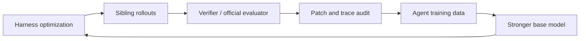

<p align="center">
  
</p>

English | [中文](README_zh.md)

<div align="center">

# Helix: Let Models and Harnesses Co-Evolve

Helix's mission: optimize harnesses for models, then automatically turn harness-generated rollouts into trainable agent data.

<a href="https://arxiv.org/abs/2608.13951"></a>    

</div>

---

## What Is Helix?

Helix is a workspace for general-agent harness composition, evaluation, and data-loop construction. It makes it easy to build and validate different harnesses, while turning existing harnesses into reusable modules.

What is a harness?

```text
shell + session/hooks + config + prompt + tools + turn loop + acceptance + runtime policy
```

The complete harness shapes how an agent plans, calls tools, manages context, accesses services, recovers from failure, and produces verifiable work. Many existing harnesses already capture strong engineering judgment, but their combinations are often similar. Helix asks whether we can break them into lego blocks, recombine them, and search for newer, stronger harnesses.

Helix asks:

```text
For a model, how do we choose or compose the harness that fits it best?

For a scenario, how do we automatically build a data loop that pushes the
model's capabilities as far as possible while collecting multiple kinds of
rollout data for the next round of model iteration?
```

## News

- **2026-07-19**: Added the `full` search setting, making harness search stronger.
- **2026-07-17**: Helix outperformed all upstream harnesses on the LiveCodeBench subset.
- **2026-07-16**: Helix outperformed all upstream harnesses on the SWE-Bench subset.

## Core Value Proposition

Helix's core strength is the co-evolution between models and harnesses. Concretely:

### Harness Optimization

Search for the complete runtime harness that best fits a specific model: shell, config, tools, turn loop, acceptance, runtime policy, and related execution atoms. Each lego module comes from a real agent harness that has already been broadly recognized in practice, then gets recomposed into source-traceable recipes and evaluated on the target scenario.

Today Helix has decomposed and integrated 4 real product-level harnesses: OpenCode, Pi Mono, Nanobot, and Hermes Agent. The current library contains `1,332` atoms. They are organized into 8 top-level dimensions: shell, session/hooks, config, prompt, tools, turn loop, acceptance, and runtime policy, then selected, composed, and swapped through `96` standard ports / swap points in the assembly contract.

In other words, Helix has `1,000+` lego blocks for composing harnesses, and defines `96` standard interfaces where those blocks can be plugged in and compared.

### Agent Training Data Loop

Use harness search to make the same model produce as many useful rollouts as possible in the target scenario: successes, failures, near misses, regressions, preferences, and other sibling traces. Then use verifier / evaluator / patch audit to label those rollouts, convert them into trainable data, and train them back into the model, critic, router, or reranker.

For general agents, valuable training data is not just a final answer. It is a verified trace:

- the prompt and harness that shaped the run;
- the tool calls that inspected state, changed artifacts, or called external services;
- the verifier, environment, or official evaluator feedback;
- the failure mode when the run missed;
- the quality labels when it passed.

Helix creates sibling rollouts under controlled harness changes. Those siblings become positives, near misses, regression-aware negatives, no-action negatives, test-touch filters, patch-hygiene filters, and resolved-vs-resolved preference pairs.

## Core Results

| Benchmark | `pi-mono` | Best fixed candidate | Best recomposed candidate | Full search |
| --- | ---: | ---: | ---: | ---: |
| LiveCodeBench | `76/100` | `79/100` | `78/100` | `87/100` |
| SWE-Bench | `44/55` | `46/55` | `46/55` | `49/55` |

Put simply, `Best fixed candidate` and `Best recomposed candidate` are both "run one harness once" scores. You can read them as Pass@1. They are better suited for finding a good harness. The difference is only the candidate pool: the former may include manually designed predefined harnesses, while the latter only considers recipes automatically recomposed by Helix. These two columns are more about harness optimization, and show the richness of the Helix search space.

`Full search` no longer commits to one candidate upfront; it puts the searched candidates together and counts a task when any candidate solves it. You can read it as Pass@N. It is better suited for building the data flywheel, and shows the upper bound of Helix.

## Agent Training Data Loop



Even before model training, harness optimization can change the rollout distribution. These verified traces are different slices of model behavior on real tasks, and they expose the model's real weaknesses.

## Features

- **Lego-style harness assembly**: create a harness by writing a recipe.
- **Harness optimization**: generate, audit, and smoke-screen recomposed harness candidates from source-traceable lego blocks.
- **Trace-level analysis**: inspect no-write, no-bash, repair-loop, regression, tool-use, and acceptance behavior through verifiable artifacts.
- **Training-data loop contracts**: preserve the rollout labels and audit boundaries needed to build clean positives, negatives, filters, and preference pairs outside the core repo.
- **Browser builder**: inspect, swap, validate, graph, and export harness recipes from a local docs site.

## Quick Start

Install dependencies:

```bash
npm install
```

Generate the static docs site and builder:

```bash
npm run docs:site
```

Run the online docs and builder server:

```bash
npm run docs:dev
```

Open:

```text
http://127.0.0.1:5173/harness-builder.html
```

Validate the workspace:

```bash
npm run typecheck
npm test
```

## Rebuild Core Artifacts

Rebuild the public assembly, flow, and audit artifacts:

```bash
npm run assembly:contract
npm run flow:graphs
npm run executable:audit
```

## Repository Map

```text
packages/
  contracts/            Shared IDs, schema, events, and port fixtures.
  lego-runtime/         Runtime composition, lifecycle, and acceptance.
  lego-session/         Session storage, projection, branching, compaction.
  lego-hooks/           Hook host, event bus, chains, schedulers, registries.
  lego-agent-loop/      Turn pipeline, provider/tool loop, cadence policies.
  lego-tools/           Filesystem, process, meta tools, and permission ports.
  lego-provider/        Provider ports, stream adapters, cassette support.
  lego-config/          Config sources, merge strategies, validators.
  lego-prompt/          Prompt/resource atoms and product prompt profiles.
  lego-ui/              UI loop, renderer, router, and snapshots.
  adapters-opencode/    OpenCode personality atoms and product shells.
  adapters-pi/          Pi Mono personality atoms and product shells.
  adapters-nanobot/     Nanobot personality atoms and product shells.
  adapters-hermes/      Hermes Agent atoms and product shells.
  recipes/              Recipe compiler, catalogs, assembly contracts, and flow graphs.
  cli/                  helix command entrypoint.
  docs-site/            Docs and browser builder generator.
  conformance/          Cross-module conformance and parity tests.

recipes/                Published declarative recipe JSON examples.
docs/reports/           Generated assembly, flow, audit, and result artifacts.
external-tools/         Local evidence collector profiles and import adapters.
scripts/                Core local launch and harness-combo maintenance scripts.
```

## Roadmap

- **Harness router**: learn when to route a task to a fixed harness, a sibling portfolio, or a search pass.
- **More source harnesses**: add adapters that expose new shells, policies, tools, and turn loops as lego modules.
- **Verifier interfaces**: make rollout labeling and patch audit contracts easier to plug into external evaluators.
