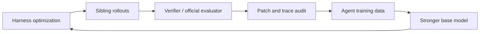

<p align="center">
  <a href="https://arxiv.org/abs/2608.13951"></a>
</p>

<p align="center">
  
</p>

[English](README.md) | 中文

<div align="center">

# Helix：让模型与Harness一起协同进化

Helix 的使命：为模型优化 harness，并自动把 harness 产出的 rollout 转成可回训的智能体数据。


</div>

---

## Helix 是什么？

Helix 是一个通用智能体 harness 组合、评测与数据飞轮构建的工作区，在这里，可以轻易地构建和验证不同的Harness，并把先前的Harness做成可复用的模块。

什么是Harness？

```text
shell + session/hooks + config + prompt + tools + turn loop + acceptance + runtime policy
```

完整 harness 会影响 agent 如何规划、调用工具、管理上下文、访问服务、从失败中恢复，并产出可验证的工作结果。现在已经有了那么多 harness，凝结了工程师们的智慧，但大家的组合方式大同小异，那我们能否将它们全部拆散成 lego 块，然后重新组合，以搜索的方式获得更新更强的 harness 呢？

Helix 要回答的问题是：

```text
对于一个模型，我们如何挑选或组合出最适合它的 harness？

对于一个场景，我们如何自动地构建数据飞轮，尽可能发挥模型的能力并采集到多方面的数据，以进行下一步自动迭代？
```

## News

- **2026-07-19**：加入了 `full` 搜索口径，搜索能力变得更强了！
- **2026-07-17**：Helix 在 LiveCodeBench 的 subset 上战胜了所有上游 harness！
- **2026-07-16**：Helix 在 SWE-Bench 的 subset 上战胜了所有上游 harness！

## 核心卖点

Helix 的核心亮点在于模型和harness的协同进化，具体来说：

### Harness Optimization

根据模型来搜索适合它的完整运行 harness：shell、config、tools、turn loop、acceptance、runtime policy 等。每个乐高模块都来自于已经被广泛认可的真实 agent harness，再被组合成 source-traceable recipe，并在目标场景里评测。

目前 Helix 已经拆解并接入 4 个真实产品级 harness：OpenCode、Pi Mono、Nanobot、Hermes Agent。当前一共有 `1,332` 个 atom。它们按 8 个高层维度组织：shell、session/hooks、config、prompt、tools、turn loop、acceptance、runtime policy；再通过 assembly contract 里的 `96` 个标准 port / swap point 进行选择、组合和替换。

换句话说，我们有 `1,000+` 个用于组合harness的 lego 块规模，并定义了`96` 种这些块可以插入和比较的标准接口数量。

### Agent Training Data Loop

先用 harness search 让同一个模型在目标场景里尽可能多地产生成功、失败、near-miss、regression、preference 等 rollouts；再用 verifier / evaluator / patch audit 给这些 rollout 打标签，形成可训练数据，最终训回模型、critic、router 或 reranker。

对通用智能体来说，高价值训练数据不是最后一句答案，而是一条可验证 trace：

- 哪个 prompt 和 harness 影响了本次运行；
- 模型如何调用工具检查状态、修改 artifact 或访问外部服务；
- verifier、环境或 official evaluator 给了什么反馈；
- 失败时失败在 no-write、no-bash、target-miss、regression 还是其他环节；
- 通过时结果是否干净；在代码切片中，是否触碰测试，是否带 path-noise。

Helix 通过可控 harness 变化生成 sibling rollouts。这些 sibling 可以变成正样本、near-miss、regression-aware negatives、no-action negatives、test-touch filters、patch-hygiene filters，以及 resolved-vs-resolved preference pairs。

## 核心结果

| Benchmark | `pi-mono` | 最佳固定候选 | 最佳重组候选 | 全量搜索 |
| --- | ---: | ---: | ---: | ---: |
| LiveCodeBench | `76/100` | `79/100` | `78/100` | `87/100` |
| SWE-Bench | `44/55` | `46/55` | `46/55` | `49/55` |

通俗地说，`最佳固定候选` 和 `最佳重组候选` 都是“一次只跑一个 harness”的成绩。可以理解为Pass@1。这两者更适合用于“得到一个好的harness”，他们区别只在候选池：前者可以包含人工定制的预定义 harness，后者只看 Helix 自动重新拼出的 recipe。这两者更适合用于优化Harness，展示的是Helix的丰富程度。
`全量搜索` 则不再提前押注某一个候选，而是把已经搜索过的候选都放进来，只要任意一个候选做对就算覆盖，可以理解为Pass@N。它更适合用于构建数据飞轮，展示的是 Helix 的上限。

## Agent Training Data Loop



即使还没回训模型，harness optimization 也能改变 rollout 分布；这些可验证 trace 是模型在真实任务中产出的不同截面的数据，这些数据暴露出了模型真正的弱点。

## 功能亮点

- **Lego-style harness assembly**：创建一个 harness，只需要写一个 recipe。
- **Harness optimization**：从 source-traceable lego blocks 生成、审计并 smoke-screen 重组 harness 候选。
- **Trace-level analysis**：通过可验证 artifact 检查 no-write、no-bash、repair-loop、regression、tool-use 和 acceptance 行为。
- **Training-data loop contracts**：保留 rollout labels 和 audit boundaries，便于在核心仓库外构建 clean positives、negatives、filters 和 preference pairs。
- **Browser builder**：在本地 docs site 中检查、替换、验证、画图和导出 harness recipe。

## Quick Start

安装依赖：

```bash
npm install
```

生成静态 docs site 和 builder：

```bash
npm run docs:site
```

启动在线 docs/builder server：

```bash
npm run docs:dev
```

打开：

```text
http://127.0.0.1:5173/harness-builder.html
```

验证工作区：

```bash
npm run typecheck
npm test
```

## 重建核心产物

重建公开的 assembly、flow 和 audit 产物：

```bash
npm run assembly:contract
npm run flow:graphs
npm run executable:audit
```

## 仓库结构

```text
packages/
  contracts/            Shared IDs, schema, events, and port fixtures.
  lego-runtime/         Runtime composition, lifecycle, and acceptance.
  lego-session/         Session storage, projection, branching, compaction.
  lego-hooks/           Hook host, event bus, chains, schedulers, registries.
  lego-agent-loop/      Turn pipeline, provider/tool loop, cadence policies.
  lego-tools/           Filesystem, process, meta tools, and permission ports.
  lego-provider/        Provider ports, stream adapters, cassette support.
  lego-config/          Config sources, merge strategies, validators.
  lego-prompt/          Prompt/resource atoms and product prompt profiles.
  lego-ui/              UI loop, renderer, router, and snapshots.
  adapters-opencode/    OpenCode personality atoms and product shells.
  adapters-pi/          Pi Mono personality atoms and product shells.
  adapters-nanobot/     Nanobot personality atoms and product shells.
  adapters-hermes/      Hermes Agent atoms and product shells.
  recipes/              Recipe compiler, catalogs, assembly contracts, and flow graphs.
  cli/                  helix command entrypoint.
  docs-site/            Docs and browser builder generator.
  conformance/          Cross-module conformance and parity tests.

recipes/                Published declarative recipe JSON examples.
docs/reports/           Generated assembly, flow, audit, and result artifacts.
external-tools/         Local evidence collector profiles and import adapters.
scripts/                Core local launch and harness-combo maintenance scripts.
```

## Roadmap

- **Harness router**：学习什么时候用 fixed harness、sibling portfolio 或 search pass。
- **更多源 harness**：接入新的 adapters，把 shell、policy、tools 和 turn loop 暴露成 lego modules。
- **Verifier interfaces**：让 rollout labeling 和 patch audit contracts 更容易接到外部 evaluator。
