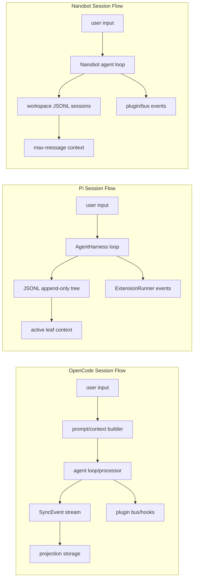
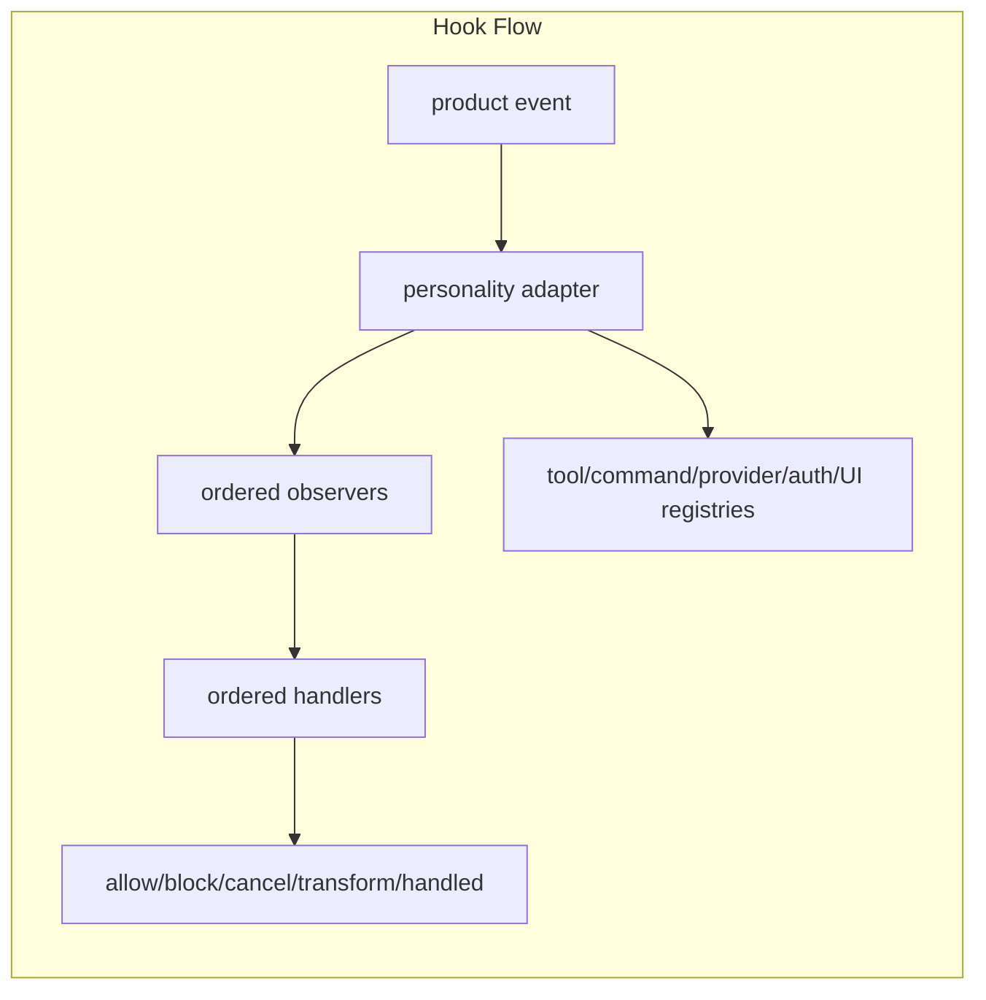

# Module Map

This map records how upstream OpenCode, Pi Mono, and Nanobot concepts are being decomposed into Helix modules.

For the target port/atom vocabulary that this map is being decomposed toward, see `docs/lego-block-catalog.md`. This file maps upstream ownership; the catalog defines the lego block inventory and general composition interfaces.

## OpenCode

Reference:

- Repository: `https://github.com/anomalyco/opencode`
- Branch: `dev`
- Commit: `1a8fd0e1dca58a473d85500530dd45def3f512ab`

| Upstream Area | Reference Files | Helix Module |
| --- | --- | --- |
| Session service | `packages/opencode/src/session/session.ts` | `packages/lego-session` + `packages/adapters-opencode` |
| MessageV2 projection | `packages/opencode/src/session/message-v2.ts` | `ProjectionSessionService` MessageV2-to-common message adapter |
| Prompt/turn orchestration | `packages/opencode/src/session/prompt.ts` | `packages/lego-agent-loop` + `packages/recipes` |
| Stream processor | `packages/opencode/src/session/processor.ts` | `packages/lego-agent-loop` lifecycle and future streaming semantics |
| Compaction | `packages/opencode/src/session/compaction.ts` | `lego-session` entries + `lego-hooks` compaction events |
| Plugin contract | `packages/plugin/src/index.ts` | `packages/adapters-opencode` |
| Plugin runtime | `packages/opencode/src/plugin/index.ts` | `packages/lego-hooks` + `packages/adapters-opencode` |
| SDK/server/workspace/control-plane/TUI/Web/Desktop/Slack shell | product API, interactive TUI, UI, and collaboration surfaces | split `packages/adapters-opencode/src/opencode-*.ts` shells + registration facade |

Current OpenCode personality:

- Uses `ProjectionSessionService`.
- Replays OpenCode-style SyncEvents, creates descending `ses_` IDs, preserves update-time/id sorting, preserves core Session.Info fields, converts MessageV2 text/reasoning/tool/compaction/custom parts into common message parts, exposes cursor-based message paging, and can persist the projection through SQLite-backed storage.
- Uses OpenCode hook adapter atoms for plugin loading, event mapping, registry bridge, permission bridge, workspace bridge, and shell bridge.
- Registers builtin auth/provider plugin descriptors for Codex, GitHub Copilot, GitLab, Poe, Cloudflare, Azure, DigitalOcean, and xAI.
- Exposes OpenCode product surfaces: `opencode.sdk`, `opencode.server.factory`, `opencode.workspace`, `opencode.control-plane`, `opencode.tui`, `opencode.web`, `opencode.desktop`, and `opencode.slack`.
- Drives the shared TUI event loop locally and through `POST /v1/tui/event` for theme/model/submit/help interactions.
- Supports plugin-intercepted deterministic fixture turns in conformance tests.

## Pi Mono

Reference:

- Repository: `https://github.com/earendil-works/pi`
- Branch: `main`
- Commit: `7c2775f6f67c38ed491a1ff68240ee4f8ba688da`

| Upstream Area | Reference Files | Helix Module |
| --- | --- | --- |
| Session manager | `packages/coding-agent/src/core/session-manager.ts` | `packages/lego-session` |
| Session format | `packages/coding-agent/docs/session-format.md` | `JsonlTreeSessionService` |
| Extension types | `packages/coding-agent/src/core/extensions/types.ts` | `packages/adapters-pi` |
| Extension runner | `packages/coding-agent/src/core/extensions/runner.ts` | `packages/lego-hooks` + `packages/adapters-pi` |
| Extension docs | `packages/coding-agent/docs/extensions.md` | `packages/adapters-pi` |
| Hook design | `packages/agent/docs/hooks.md` | `packages/lego-hooks` |
| CLI runner | coding-agent package entrypoints | `packages/cli` + split `pi-cli` product shell |
| SDK/TUI/RPC/Web UI | product API, interactive TUI, and UI/control surfaces | `packages/adapters-pi/src/product-surface.ts` + `packages/recipes` |
| Package manager/examples/browser smoke/release | coding-agent package and release surfaces | `packages/adapters-pi/src/product-surface.ts` + `packages/recipes` |

Current Pi personality:

- Uses `JsonlTreeSessionService`.
- Preserves Pi-style append-only JSONL v3 sessions, migrates JSONL v1/v2 records into the common v3 tree model, keeps `id`/`parentId` leaf branching, `continueRecent/open/forkFrom/list/listAll`, `branchWithSummary`, single-path branched-session extraction, session labels on extracted paths, and context construction from the active tree path.
- Uses Pi extension adapter atoms for extension loading, event mapping, TypeBox/schema normalization, dynamic tool/registry bridge, context bridge, and runtime event bridge.
- Exposes Pi product surfaces: `pi.sdk`, `pi.cli`, `pi.tui`, `pi.rpc`, `pi.web-ui`, `pi.server.factory`, `pi.package-manager`, `pi.extension-examples`, `pi.browser-smoke`, and `pi.release-hardening`.
- Drives the shared TUI event loop locally and through `POST /v1/tui/event` for theme/model/submit interactions, including structured invalid-theme errors.
- Supports extension-registered tools and tool blocking in conformance tests.

## Nanobot

Reference:

- Repository: `https://github.com/HKUDS/nanobot`
- Tag: `v0.2.0`
- Commit: `c018c3fb6a5cedf2dcd7bbd0bf4fce5eb9b54bf7`
- Package: `nanobot-ai==0.2.0`

| Upstream Area | Reference Files | Helix Module |
| --- | --- | --- |
| Session manager | `nanobot/session/manager.py` | `packages/lego-session` + `packages/adapters-nanobot` |
| Session format | `<workspace>/sessions/*.jsonl` with metadata and message records | `JsonlTreeSessionService` personality over common session ports |
| Config paths/schema | `nanobot/config/paths.py`, `nanobot/config/schema.py` | `packages/lego-config` + Nanobot config personality |
| Agent CLI | `nanobot/cli/commands.py` | split `nanobot-cli` product shell |
| Provider factory | `nanobot/providers/factory.py`, provider modules | `packages/lego-provider` + Nanobot provider descriptor atoms |
| Tool loading/execution | `nanobot/agent/tools/*` | `packages/lego-tools` + Nanobot tool schema/result bridges |
| Hook/event runtime | `nanobot/agent/hook.py`, `nanobot/bus/*` | `packages/lego-hooks` + Nanobot plugin/event mapper |
| SDK/TUI/Web/server | CLI, Web UI, and API surfaces | `packages/adapters-nanobot/src/product-surface.ts` + `packages/recipes` |

Current Nanobot personality:

- Uses `JsonlTreeSessionService` with Nanobot-specific JSONL session path metadata and session key conventions.
- Preserves the upstream baseline of `~/.nanobot/config.json`, `~/.nanobot/workspace`, `<workspace>/sessions/*.jsonl`, and `nanobot agent -m`.
- Adds Nanobot personality atoms under existing planes only: `nanobot.session.*`, `nanobot.plugin.*`, `nanobot.turn.*`, `nanobot.tool.*`, `nanobot.provider.*`, `nanobot.config.*`, `nanobot.prompt.*`, and `nanobot.ui.*`.
- Exposes Nanobot product surfaces: `nanobot.sdk`, `nanobot.cli`, `nanobot.tui`, `nanobot.web-ui`, and `nanobot.server.factory`.
- Drives the shared TUI event loop and server routes for health, Web UI, TUI snapshot, provider-backed agent turns, and internal deterministic fixture traces.
- Supports fixture differential, reverse assembly, product shell smoke, and product-level agent-loop semantic replay without introducing a new top-level lego plane.

## Common Modules Implemented

| Module | Status |
| --- | --- |
| `contracts` | Initial implementation |
| `lego-runtime` | Initial module registry and assembler |
| `lego-session` | SessionService plus JSONL tree, in-memory projection, and SQLite projection storage variants |
| `lego-hooks` | Hook atoms for event bus, schedulers, observer/handler chains, cleanup/error policy, and source-aware registries; `LegoHookHost` compatibility facade |
| `lego-provider` | Fake provider plus OpenAI-compatible, OpenRouter, Anthropic, and Google streaming adapters |
| `lego-tools` | Default echo/read/write/edit/grep/find/ls/bash/todo/task/subagent tools backed by filesystem, process-runner, and permission policy ports |
| `lego-agent-loop` | Common turn loop plus split pipeline, product-turn, cadence, and port fixture block sources |
| `lego-config` | Config facade over source, merge, validator, and discovery atoms |
| `lego-prompt` | Prompt facade over resource loader/discovery, system builder, tool renderer, model adapter, and compaction atoms |
| `lego-ui` | UI facade over event-loop, renderer, command-router, theme, input-normalizer, and snapshot atoms |
| `cli` | Initial `helix run <product>` recipe entrypoint |
| `adapters-opencode` | Plugin/session personality atoms plus OpenCode product surfaces |
| `opencode-sdk/server/workspace/control-plane/tui/web/desktop/slack` | OpenCode-only product shell modules registered by the OpenCode recipe |
| `adapters-pi` | Extension/session personality atoms plus Pi product surfaces |
| `pi-sdk/cli/tui/rpc/web-ui/server/package-manager/examples/browser-smoke/release-hardening` | Pi-only product shell modules registered by the Pi recipe |
| `adapters-nanobot` | Plugin/session personality atoms plus Nanobot product surfaces |
| `nanobot-sdk/cli/tui/web-ui/server` | Nanobot-only product shell modules registered by the Nanobot recipe |
| `recipes` | Initial OpenCode, Pi Mono, Nanobot, and neutral assembly recipes |
| `docs-site` | Static assembly console generated from recipes and TODO progress |
| `conformance` | Session, hook, agent-loop lifecycle/semantic replay, product workflow parity, fixture replay, recipe, and CLI tests |

## Ownership Tags

| Upstream Reference | Ownership |
| --- | --- |
| OpenCode `session/session.ts` | Common session contract plus OpenCode projection personality |
| OpenCode `session/message-v2.ts` | OpenCode projection personality with common message conversion |
| OpenCode `session/prompt.ts` | Common agent loop and OpenCode prompt personality |
| OpenCode `session/processor.ts` | Common agent loop lifecycle and provider/tool stream processing |
| OpenCode `session/compaction.ts` | Common session context, compaction entries, and compaction hooks |
| OpenCode `plugin` package/runtime | OpenCode personality plugin atoms over common hook host |
| OpenCode SDK/server/control-plane/workspace/TUI/Web/Desktop/Slack surface | Split OpenCode personality product shells over the assembled harness |
| Pi `session-manager.ts` | Common session contract plus Pi JSONL-tree personality |
| Pi `session-format.md` | Pi JSONL storage and migration boundary |
| Pi extension types/runner/docs | Pi personality extension atoms over common hook host and registries |
| Pi SDK/CLI/TUI/RPC/Web UI/server/package/release files | Split Pi personality product shells over the assembled harness |
| Pi package-manager/examples/browser-smoke/release files | Pi personality package and release surface over the assembled harness |
| Nanobot `session/manager.py` | Common session contract plus Nanobot JSONL personality |
| Nanobot config paths/schema | Common config contract plus Nanobot path/default personality |
| Nanobot provider factory/modules | Common provider ports plus Nanobot provider descriptor personality |
| Nanobot tools/plugins/events | Common tool/hook ports plus Nanobot plugin and event bridges |
| Nanobot SDK/CLI/TUI/Web/server surface | Split Nanobot personality product shells over the assembled harness |

## Helix Agent Loop Source Groups

The agent-loop package intentionally has more logical lego blocks than top-level files. The source is now split by block source group so the physical layout explains where those blocks come from:

| Source Group | Files | Owns |
| --- | --- | --- |
| Pipeline | `packages/lego-agent-loop/src/pipeline/*` | turn pipeline atom ids, strategy catalog, strategy selection, and `turn.pipeline.trace` emission |
| Product turn | `packages/lego-agent-loop/src/product-turn/*` | OpenCode/Pi/Nanobot/Hermes turn profiles, atom id factories, runtime context rendering, and turn defaults |
| Cadence | `packages/lego-agent-loop/src/cadence/*` | request-boundary, tool-batch scheduler, final-summary policy, policy bundle, and descriptor registry |
| Ports | `packages/lego-agent-loop/src/ports/*` | turn and agent-loop port contract fixtures used by block ledger, docs, and assembly contracts |
| Compatibility shims | `pipeline.ts`, `product-turn-atoms.ts`, `cadence-policies.ts`, `port-fixtures.ts` | stable legacy import paths that only re-export the split source groups |

## Data Flow

## Fixture Replay

Helix now includes upstream-shaped fixtures:

- `packages/conformance/fixtures/pi-session-v3.jsonl`
- `packages/conformance/fixtures/opencode-projection-events.jsonl`

These prove that Pi-style JSONL sessions and OpenCode-style projection events can be loaded into the common transcript contract. The session conformance suite also covers legacy Pi JSONL v1/v2 migration into the v3 tree shape. The fixture replay suite generates large upstream-shaped Pi JSONL and OpenCode projection traces with 128 transcript messages each, covering ordering, pagination, branching, and schema validity.

Helix also vendors pinned upstream-derived replay fixtures in `packages/conformance/fixtures/upstream/`:

- Pi `large-session.jsonl` from `earendil-works/pi` commit `7c2775f6f67c38ed491a1ff68240ee4f8ba688da`, replaying 1019 JSONL records into 914 common transcript messages.
- OpenCode `session-timeline.fixture.ts` from `anomalyco/opencode` commit `1a8fd0e1dca58a473d85500530dd45def3f512ab`, exported into 525 projection events and 168 common transcript messages.

`runUpstreamProductWorkflowParity` now verifies those pinned fixture sessions through product SDK surfaces after running provider-stream, TUI event-loop, UI/RPC, and live server workflows on both assembled recipes.

`runUpstreamE2EParity` goes one layer deeper with pinned upstream smoke/test references in `e2e-manifest.json`. It maps OpenCode's session timeline smoke behavior to offline source/target readback, paging, fork, and diff checks, and maps Pi's dynamic tool registration, runtime session events, cancellation, and branching tests to the assembled lego harness.

Nanobot baseline evidence is currently recorded in `docs/nanobot-baseline.md` and `runNanobotFitAudit()`. The pinned fixture mode proves Nanobot JSONL session shape, CLI protocol contract, provider endpoint policy, default tool registry mapping, product-shell smoke, and reverse assembly. Full native subprocess/task parity is intentionally promoted to TODO-002, where original Nanobot will be evaluated beside original OpenCode and Pi on real tasks.

`runLiveProviderParity` adds the opt-in credential-backed provider gate: both assembled products can be run against OpenAI-compatible, OpenRouter, Anthropic, or Google streaming adapters, then read back through product SDKs. The workflow is split into `createLiveProviderCredentialGate`, `createLiveProviderRunner`, `createLiveProviderArtifactWriter`, `createLiveProviderArtifactVerifier`, and `createLiveProviderCassetteGenerator`, so recipes/tests can swap credential resolution, live execution, reporting, and sanitized stream recording separately. Conformance covers the HTTP streaming adapter path with a local SSE provider and cassette recording; real external provider execution remains environment-dependent.
